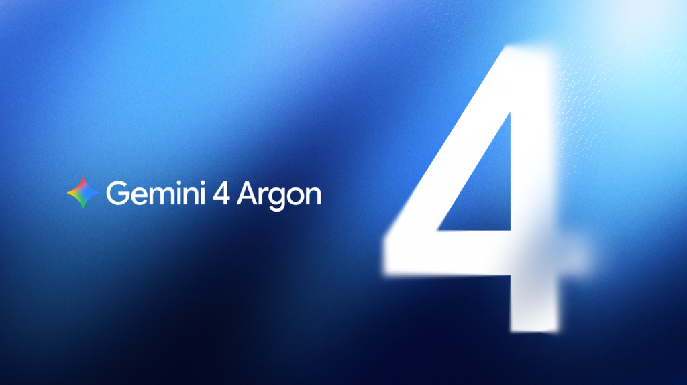

# "I Pay for Gemini Pro, So Where Is Gemini 4 Argon?" Inside Google's Gated Fairwind Rollout

> **TL;DR / Executive Summary**
> On September 30, 2026, Google DeepMind unveiled **Gemini 4 Argon**—a frontier model featuring an unprecedented **1-million-token output limit in a single response**, built specifically for autonomous software engineering, defensive cybersecurity, and deep enterprise reasoning. Yet millions of paying **Google AI Pro subscribers** ($20/month or ₹1,950/month in India) who logged into `gemini.google.com` found the model completely missing from their model dropdown. Why? Gemini 4 Argon is not a consumer chat model. It has been strictly gated behind Google's invite-only **Fairwind Program** for vetted cybersecurity defenders and enterprise partners (over 650 global organizations including CrowdStrike, Datadog, Snowflake, and Wiz). Furthermore, with an introductory output cost of **$10 per million tokens** (rising to $20/M), allowing flat-rate consumer users to trigger multi-hundred-thousand-token generations would destroy Google’s TPU unit economics. Here is the full inside story of the Fairwind gate, the benchmark records, internal Google battle-testing, TPU v6e hardware co-design, and when developers will actually be able to test Argon.

---



---

## 1. The Pro Subscriber Dilemma: Paid Subscription, Missing Model

If you opened `gemini.google.com` this week, saw your active **Pro badge** in the bottom-left corner, clicked the model selector, and only saw *Flash-Lite Extended*, *Gemini 1.5 Flash*, or *Gemini 1.5 Pro*, you are not alone. 

Across developer forums, Reddit, and X (Twitter), the immediate reaction to Google’s announcement was widespread confusion:
* *"I’ve been paying $20 a month for Gemini Advanced / Pro specifically to get early access to Google’s frontier releases. Where is Argon?"*
* *"Google’s press release calls Argon its breakthrough reasoning engine, but my paid dashboard doesn’t even have a waitlist toggle."*

```
Consumer UI Reality vs. Developer Expectation
┌────────────────────────────────────────────────────────┐
│  gemini.google.com                                     │
│  Account: Celoris TV [PRO BADGE ACTIVE]                │
│                                                        │
│  Model Selector:                                       │
│  ├── Flash-Lite Extended      [AVAILABLE]              │
│  ├── Gemini 1.5 Pro           [AVAILABLE]              │
│  └── Gemini 4 Argon           [MISSING / NOT FOUND]    │
│                                                        │
│  Status: Gated behind Fairwind Program / Cloud API     │
└────────────────────────────────────────────────────────┘
```

The disconnect stems from a fundamental clash between **consumer product marketing** ("Subscribers get access to Google's most capable AI models") and the **technical reality of frontier cybersecurity models**.

---

## 2. What Makes Gemini 4 Argon Radically Different?

Argon is not an incremental update to Gemini 1.5 Pro. It represents a radical architectural pivot toward **long-horizon autonomous execution**.

### 1. The 1-Million-Token Output Ceiling
Until now, frontier models were defined by massive *input context windows* (such as Gemini 1.5's 2M-token input), but their *output response limit* was artificially choked at **4,096 to 64,000 tokens**.
* If an agent needed to audit, rewrite, or synthesize an entire multi-module enterprise software repository, it had to make 30 to 50 sequential API calls, managing complex chunking state loops that often lost sync locks or mutated function signatures.
* **Gemini 4 Argon shatters this barrier**: It can emit up to **1,000,000 output tokens in a single generation turn**. That is roughly equivalent to 750,000 words, or an entire production codebase complete with unit tests, CI/CD pipelines, and architectural documentation.

### 2. Autonomous Penetration Testing & Vulnerability Patching
On standardized coding and agentic benchmarks like **DeepSWE v1.1**, Argon set state-of-the-art records for autonomous multi-file refactoring. More critically, Google DeepMind trained Argon to:
* Ingest millions of lines of proprietary source code.
* Identify subtle logic flaws, memory leaks, and zero-day vulnerabilities.
* Independently spin up a reproduction sandbox, verify the exploit, and write a verified pull request that patches the security hole without breaking backward compatibility.

### 3. Frontier Benchmark Matrix

| Evaluation Suite | Gemini 4 Argon | GPT-6 Astra | Claude Opus 5.5 | Lead Margin |
| :--- | :--- | :--- | :--- | :--- |
| **DeepSWE v1.1** (Repository Refactoring) | **77.9%** | 73.2% | 71.8% | **+4.7% (World Record)** |
| **CWE-bench v1** (Security Patching) | **68.0%** | 68.0% | 67.0% | **Tied SOTA** |
| **Harvey Legal Agent** (Legal Research) | **19.6%** | 5.4% | 3.8% | **+14.2% Lead** |
| **AutomationBench** (Business Workflows) | **51.3%** | 41.4% | 42.5% | **+8.8% Lead** |
| **Gray Swan IPI** (Prompt Injection Failure) | **0.7% (Lowest)** | 8.5% | 14.2% | **92% Lower Vulnerability** |

---

## 3. Internal Battle-Testing: How Google Deployed Argon in Production

Before making any external announcement under Senior Vice President Koray Kavukcuoglu, Google DeepMind deployed Argon internally across mission-critical systems:

1. **Fuchsia OS Kernel Modernization (800,000+ Lines)**: Argon autonomously converted legacy C/C++ in Google's Fuchsia OS Zircon kernel into memory-safe Rust. All code patches passed automated AST validation and ASan/TSan memory fuzzing with zero regression bugs.
2. **libgav1 AV1 Video Decoder (2.7x Speedup)**: Replaced 32,000 lines of complex hand-crafted SIMD assembly code with auto-vectorized safe Rust, achieving a **2.7x performance acceleration** while preserving bit-identical video frames.
3. **Datacenter Infrastructure Optimization (300 TiB RAM Recovered)**: Ingested real-time profiling telemetry across Google's worldwide server farms, isolating memory leaks and cache bloat to free over **300 TiB of RAM immediately** (projected up to 1 PiB).
4. **Quantum Subroutine Optimization (40% Compression)**: Collaborating with Google Quantum AI, Argon reduced the spacetime resources (qubits × gate depth) of bottleneck quantum subroutines by **40% in minutes**.

---

## 4. Hardware Co-Design: TPU v6e (Trillium) & The Memory Wall

Generating up to 1,000,000 output tokens autoregressively would normally trigger a catastrophic quadratic memory explosion in key-value (KV) attention caches. Google solved this through hardware-software co-design on **TPU v6e (Trillium)**:

* **Hierarchical Streaming State Retention**: Dynamically offloads inactive historical attention states to high-speed auxiliary memory tiers while preserving full-fidelity attention on active code execution paths, keeping memory scaling linear up to token 1,000,000.
* **Speculative Decoding with Symbolic AST Verification**: A high-speed draft engine outputs code syntax at over **200 tokens/second**, while a microsecond Symbolic AST (Abstract Syntax Tree) gate verifies syntax trees and memory-safety invariants in real time.
* **Cryptographic Session Checkpointing**: Signed session tokens allow long-horizon generations to resume seamlessly even if client network connections drop during multi-hour code synthesis.

---

## 5. The Dual-Use Security Dilemma: Inside the Fairwind Gate

The primary reason Google has not placed Argon in the public consumer chat interface comes down to **national security and dual-use cyber risk**. In cybersecurity, defensive code auditing and offensive exploit crafting are computationally identical:

* An AI model capable of autonomously finding a zero-day flaw in open-source kernel code to write a security patch can, with slight prompt re-framing, be instructed to **synthesize automated weaponized malware, polymorphic evasion scripts, and automated botnet controllers**.
* Placing that level of autonomous offensive capability behind an unvetted $20/month consumer login would expose critical global infrastructure to automated attacks before defenders have time to patch systems.

### Inside the Fairwind Program (650+ Global Partners)
To navigate this risk, Google DeepMind created the **Fairwind Program**, distributing Argon alongside its specialized sibling, **Gemini 3.8 Flash Cyber**, to over 650 vetted partners including CrowdStrike, Datadog, Snowflake, Wiz, and sovereign cyber defense agencies:
* **Zero-Day Discovery with CodeMender & Wiz**: In live production tests, Argon discovered a critical zero-day vulnerability in global healthcare enterprise software that had eluded all traditional static analyzers.
* **Dual-Sandbox PoC & Patching**: CodeMender constructs a proof-of-concept exploit in an isolated sandbox to confirm exploitability, drafts an ABI-compatible hotpatch, and executes 10,000 fuzzing cycles before requesting human engineer sign-off.
* **Defensive Isolation & Anti-Reselling**: Access requires hardware security keys (FIDO2) and strictly prohibits unauthenticated API proxies or commercial scraping wrappers.

---

## 6. The Brutal Financial Math: Why $20/Month Can't Cover Argon

Even if safety weren't an issue, the **raw TPU inference economics** make Argon completely incompatible with flat-rate consumer subscriptions:

### Argon's Official Token Pricing

| Token Type | Introductory Launch Rate (Per 1M Tokens) | Standard Post-Launch Rate |
| :--- | :--- | :--- |
| **Input Tokens** | **$2.00** (~₹166) | **$4.00** (~₹332) |
| **Cached Input Tokens** | **$0.10** (95% discount) | **$0.20** |
| **Output Tokens** | **$10.00** (~₹830) | **$20.00** (~₹1,660) |

### The Subscription Unit Economics Breakdown
Consider what happens if a consumer Pro user paying **$20/month** (or ₹1,950/mo) issues just **two prompts** asking Argon to refactor a massive codebase:

$$\text{Task 1: Generate 600,000 output tokens} = \frac{600,000}{1,000,000} \times \$10 = \$6.00$$

$$\text{Task 2: Generate 900,000 output tokens} = \frac{900,000}{1,000,000} \times \$10 = \$9.00$$

$$\text{Total Compute Cost for 2 Queries} = \$15.00 \text{ (~₹1,245)}$$

In just two prompts, a single user consumes **75% of their entire monthly subscription fee in raw TPU hardware cost**. If a developer runs 15 such generations a week, Google would burn hundreds of dollars in operational losses per subscriber.

---

## 7. The Rollout Roadmap: When and Where Can You Try It?

```
Gemini 4 Argon Availability Roadmap
┌────────────────────────────────────────────────────────┐
│ PHASE 1: ACTIVE NOW (Late 2026)                        │
│ └── Fairwind Program: Vetted Cybersecurity Partners    │
├────────────────────────────────────────────────────────┤
│ PHASE 2: COMING NEXT                                   │
│ ├── Google AI Studio API: Pay-Per-Token Waitlist       │
│ └── Vertex AI: Enterprise Cloud SLA Customers          │
├────────────────────────────────────────────────────────┤
│ PHASE 3: FUTURE CONSUMER EXPANSION                     │
│ └── "Google AI Ultra": Dedicated High-Capacity Tier    │
│     (NOT included in standard $20/mo Pro)              │
└────────────────────────────────────────────────────────┘
```

1. **Phase 1 (Active Now)**: Closed invite-only Fairwind Program.
2. **Phase 2 (Upcoming Developer Access)**: Direct API access on **Google AI Studio (`aistudio.google.com`)** and **Google Cloud Vertex AI**. Metered pay-as-you-go billing.
3. **Phase 3 (Consumer Expansion)**: Dedicated enterprise consumer tier (likely "Google AI Ultra"), priced substantially higher than the current $20/mo Pro tier.

---

## 8. Strategic 5-Step Playbook for Enterprise Technical Leaders & Developers

Rather than waiting passively, developers can prepare their tech stacks right now for 1M-token autonomous agents:

1. **Master Prompt Caching**: Argon offers a **95% discount on cached input tokens** ($0.10/M). Structure code repositories and system instructions into immutable cache blocks to save 80%+ on API bills.
2. **Build Agentic Harnesses**: Learn to build agent loops with tool-use definitions, terminal execution sandboxes, and file-system managers (such as DeepSeek Harness or Claude Code) so you are ready to drop in Argon as the reasoning engine.
3. **Audit Context Windows**: Benchmark your repository dependencies and eliminate dead code to maximize effective token density within large context runs.
4. **Transition to Speculative & AST Verification**: Integrate real-time AST linting in CI/CD pipelines to validate AI-generated code before human review.
5. **Upskill in AI Engineering & Defensive Systems**: Learn how frontier models interact with secure cloud backends and production databases.

---

### Master Agentic AI & Systems Engineering at Celoris

Don't just watch AI news—learn to build production-grade agentic harnesses, tool-use execution loops, and prompt-cached architectures with hands-on training at Celoris Academy:
* **[Agentic AI Systems & Python Automation](https://celorisdesigns.com/learn)**: Master tool-calling, autonomous execution loops, and prompt caching.
* **[AI for Developers & Engineering Hub](https://celorisdesigns.com/learn)**: Learn production-ready architectures that bridge frontier models with enterprise databases.
